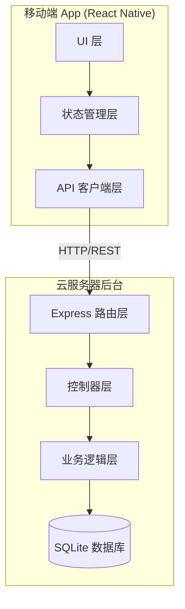
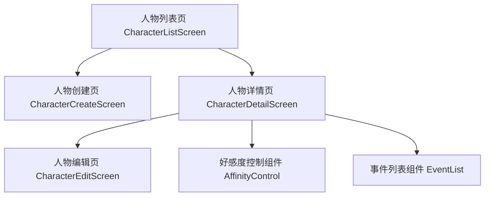

# 技术设计文档：好感度管理系统

## 概述

好感度管理系统采用前后端分离架构，移动端使用 React Native 构建跨平台 App，后台服务使用 Node.js + Express 提供 RESTful API，数据库使用 SQLite 实现轻量级持久化存储（适合部署在用户自有云服务器上）。

系统核心功能包括：
- 人物档案的 CRUD 操作
- 好感度数值的快捷调整（±1 及自定义数值）
- 好感度事件的记录与查询
- 人物列表按好感度排序展示
- App 与后台服务的数据同步

## 架构

### 整体架构



### 技术选型

| 层级 | 技术 | 理由 |
|------|------|------|
| 移动端框架 | React Native | 跨平台，JavaScript 生态统一 |
| 状态管理 | Zustand | 轻量、简洁，适合中小型应用 |
| HTTP 客户端 | Axios | 成熟稳定，支持拦截器和重试 |
| 后端框架 | Express | 轻量、灵活，Node.js 生态成熟 |
| 数据库 | SQLite (better-sqlite3) | 零配置、单文件部署，适合个人服务器 |
| 数据校验 | Zod | TypeScript 优先的运行时校验 |
| 测试框架 | Vitest | 快速、TypeScript 原生支持 |
| 属性测试 | fast-check | JavaScript/TypeScript 主流属性测试库 |

## 组件与接口

### API 接口设计

#### 人物相关

| 方法 | 路径 | 描述 |
|------|------|------|
| GET | `/api/characters` | 获取人物列表（按好感度降序） |
| POST | `/api/characters` | 创建人物 |
| GET | `/api/characters/:id` | 获取人物详情 |
| PUT | `/api/characters/:id` | 更新人物信息 |
| DELETE | `/api/characters/:id` | 删除人物及关联事件 |

#### 好感度相关

| 方法 | 路径 | 描述 |
|------|------|------|
| POST | `/api/characters/:id/affinity` | 调整好感度（含事件记录） |
| GET | `/api/characters/:id/events` | 获取好感度事件列表（时间倒序） |

### 请求/响应格式

**创建人物 POST `/api/characters`**
```json
// 请求
{ "name": "string", "avatar": "string?", "note": "string?" }
// 响应
{ "id": "string", "name": "string", "avatar": "string?", "note": "string?", "affinity": 0, "createdAt": "string" }
```

**调整好感度 POST `/api/characters/:id/affinity`**
```json
// 请求
{ "delta": "number", "reason": "string?" }
// 响应
{ "characterId": "string", "affinity": "number", "event": { "id": "string", "delta": "number", "affinityAfter": "number", "reason": "string?", "createdAt": "string" } }
```

### App 端核心组件



- **CharacterListScreen**: 主界面，展示人物列表，支持下拉刷新、长按删除、点击进入详情
- **CharacterCreateScreen**: 人物创建表单，姓名必填校验
- **CharacterDetailScreen**: 人物详情，包含好感度控制和事件历史
- **CharacterEditScreen**: 人物信息编辑表单
- **AffinityControl**: 好感度 +1/-1 按钮，长按弹出自定义数值输入
- **EventList**: 好感度事件时间线列表

### 后台服务核心模块

- **characterController**: 处理人物 CRUD 请求，参数校验
- **affinityController**: 处理好感度调整请求，边界值钳制
- **characterService**: 人物业务逻辑（创建、更新、删除级联）
- **affinityService**: 好感度计算逻辑（钳制到 [-100, 100]）、事件记录
- **database**: SQLite 连接管理与初始化

## 数据模型

### 数据库表结构

```sql
CREATE TABLE characters (
    id TEXT PRIMARY KEY,
    name TEXT NOT NULL,
    avatar TEXT,
    note TEXT,
    affinity INTEGER NOT NULL DEFAULT 0 CHECK(affinity >= -100 AND affinity <= 100),
    created_at TEXT NOT NULL DEFAULT (datetime('now'))
);

CREATE TABLE affinity_events (
    id TEXT PRIMARY KEY,
    character_id TEXT NOT NULL,
    delta INTEGER NOT NULL,
    affinity_after INTEGER NOT NULL,
    reason TEXT,
    created_at TEXT NOT NULL DEFAULT (datetime('now')),
    FOREIGN KEY (character_id) REFERENCES characters(id) ON DELETE CASCADE
);

CREATE INDEX idx_events_character ON affinity_events(character_id, created_at DESC);
```

### TypeScript 类型定义

```typescript
interface Character {
  id: string;
  name: string;
  avatar?: string;
  note?: string;
  affinity: number;  // -100 到 100
  createdAt: string;
}

interface AffinityEvent {
  id: string;
  characterId: string;
  delta: number;
  affinityAfter: number;
  reason?: string;
  createdAt: string;
}

interface AdjustAffinityRequest {
  delta: number;      // 变化值
  reason?: string;    // 原因描述
}

interface CreateCharacterRequest {
  name: string;       // 必填
  avatar?: string;
  note?: string;
}
```

### 好感度钳制逻辑

```typescript
function clampAffinity(current: number, delta: number): number {
  return Math.max(-100, Math.min(100, current + delta));
}
```


## 正确性属性

*属性是指在系统所有有效执行中都应成立的特征或行为——本质上是对系统应做什么的形式化陈述。属性是人类可读规格说明与机器可验证正确性保证之间的桥梁。*

### 属性 1：人物创建初始好感度为零

*对于任何*有效的姓名字符串，通过创建接口创建人物后，返回的人物记录中好感度数值应为 0。

**验证需求：1.2**

### 属性 2：空白姓名拒绝

*对于任何*仅由空白字符组成的字符串（包括空字符串），提交创建人物请求时系统应拒绝该请求，且不创建任何人物记录。

**验证需求：1.3**

### 属性 3：人物信息更新 round-trip

*对于任何*已存在的人物和任何有效的更新数据（姓名、头像、备注），更新人物信息后再查询该人物，返回的信息应与提交的更新数据一致。

**验证需求：2.3**

### 属性 4：删除人物级联清除事件

*对于任何*拥有好感度事件记录的人物，删除该人物后，查询该人物应返回不存在，且查询该人物的所有好感度事件也应返回空列表。

**验证需求：2.6**

### 属性 5：好感度钳制不变量

*对于任何*当前好感度值（-100 到 100 之间的整数）和任何变化值 delta，调整后的好感度应等于 `clamp(current + delta, -100, 100)`，且结果始终在 [-100, 100] 范围内。

**验证需求：3.1, 3.2, 3.4, 3.6**

### 属性 6：自定义变化量输入校验

*对于任何*非 1 到 100 之间整数的输入值（包括负数、零、小数、超过 100 的数），系统应拒绝该自定义变化量输入。

**验证需求：3.3**

### 属性 7：好感度事件记录完整性

*对于任何*好感度调整操作，生成的事件记录应包含人物标识、变化值、变化后的好感度数值、原因描述和创建时间，且变化后数值应等于调整后的实际好感度。

**验证需求：4.2, 4.4**

### 属性 8：事件列表时间倒序

*对于任何*人物的好感度事件列表，返回的事件应按创建时间从新到旧排序，即列表中每个事件的时间戳不早于其后续事件的时间戳。

**验证需求：4.3**

### 属性 9：人物列表好感度降序

*对于任何*包含多个人物的人物列表查询结果，列表中每个人物的好感度数值应大于或等于其后续人物的好感度数值。

**验证需求：5.3**

## 错误处理

### 后台服务错误处理

| 场景 | HTTP 状态码 | 响应格式 |
|------|------------|---------|
| 姓名为空 | 400 | `{ "error": "姓名不能为空" }` |
| 人物不存在 | 404 | `{ "error": "人物不存在" }` |
| 变化量无效 | 400 | `{ "error": "变化量必须为 1-100 之间的整数" }` |
| 数据库错误 | 500 | `{ "error": "服务器内部错误" }` |

### App 端错误处理

- **网络异常**：显示"网络连接异常"提示，连接恢复后自动重试上一次失败请求
- **后台返回错误**：解析错误信息并展示给用户，编辑场景保留用户输入内容
- **好感度事件保存失败**：显示错误提示并提供重试按钮
- **创建/更新失败**：显示包含后台返回失败原因的错误提示

### 输入校验

- 姓名：非空、非纯空白字符串
- 好感度变化量（自定义输入）：1 到 100 之间的正整数
- 好感度范围：钳制到 [-100, 100]，不抛出错误

## 测试策略

### 双重测试方法

本系统采用单元测试与属性测试相结合的方式确保正确性：

- **单元测试**：验证具体示例、边界情况和错误条件
- **属性测试**：验证跨所有输入的通用属性

两者互补，缺一不可。

### 属性测试配置

- **测试库**：fast-check（JavaScript/TypeScript 主流属性测试库）
- **测试框架**：Vitest
- **每个属性测试最少运行 100 次迭代**
- **每个属性测试必须通过注释引用设计文档中的属性编号**
- **标签格式**：`Feature: affinity-manager, Property {number}: {property_text}`
- **每个正确性属性由一个属性测试实现**

### 单元测试覆盖

单元测试聚焦于：
- 具体的 API 请求/响应示例（需求 1.1, 1.4, 1.5, 2.1, 2.2, 2.4）
- 错误处理场景（需求 4.5, 6.3）
- 边界情况：空列表引导提示（需求 5.4）
- 集成测试：App 启动拉取数据流程（需求 6.5）

### 属性测试覆盖

每个正确性属性对应一个属性测试：

1. **Feature: affinity-manager, Property 1: 人物创建初始好感度为零** — 生成随机有效姓名，验证创建后好感度为 0
2. **Feature: affinity-manager, Property 2: 空白姓名拒绝** — 生成随机空白字符串，验证创建被拒绝
3. **Feature: affinity-manager, Property 3: 人物信息更新 round-trip** — 生成随机人物和更新数据，验证更新后查询一致
4. **Feature: affinity-manager, Property 4: 删除人物级联清除事件** — 生成随机人物和事件，验证删除后级联清除
5. **Feature: affinity-manager, Property 5: 好感度钳制不变量** — 生成随机当前值和 delta，验证 clamp 逻辑
6. **Feature: affinity-manager, Property 6: 自定义变化量输入校验** — 生成随机无效输入，验证被拒绝
7. **Feature: affinity-manager, Property 7: 好感度事件记录完整性** — 生成随机调整操作，验证事件字段完整
8. **Feature: affinity-manager, Property 8: 事件列表时间倒序** — 生成随机事件序列，验证返回排序
9. **Feature: affinity-manager, Property 9: 人物列表好感度降序** — 生成随机人物集合，验证列表排序
